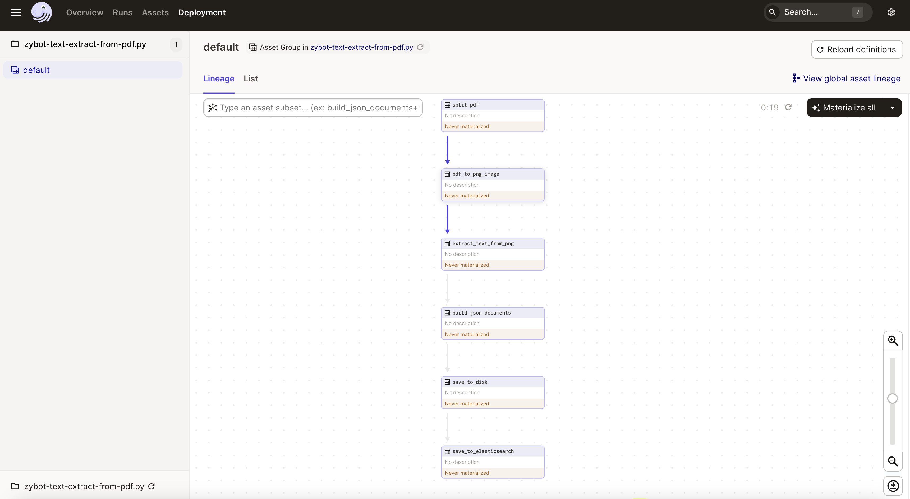
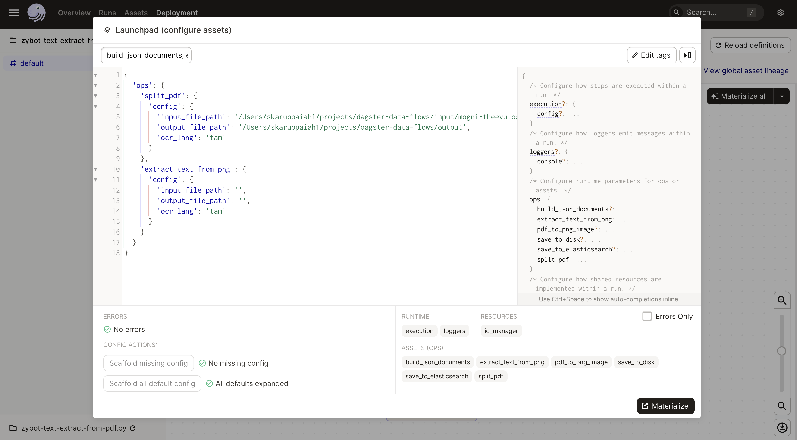
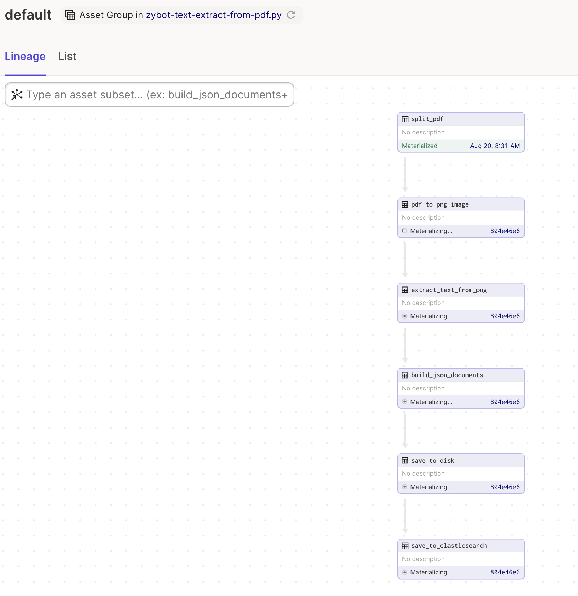
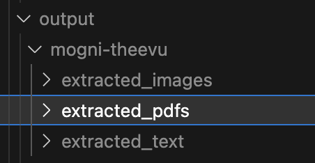
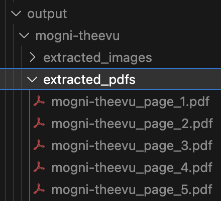
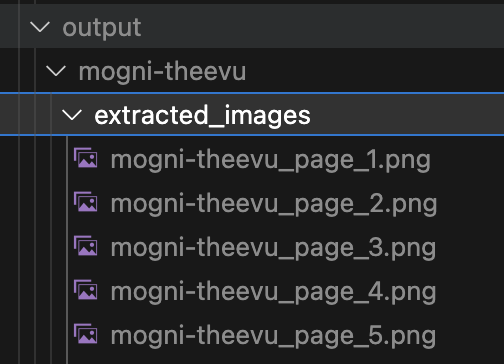
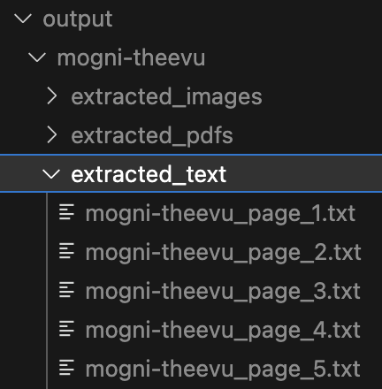

# dagster-data-pipeline

## Streamlining Data Workflows: How I Use Dagster to Solve Practical Problems for Reliable Data Pipelines


I'm sharing a collection of my work in data engineering that showcases practical applications of Dagster for managing and orchestrating data pipelines. Through these examples, you'll discover how Dagster helps streamline and optimize various data processes.

In this collection, I've included tasks related to data engineering, ML model building, and other day-to-day application-related long-running multi-step background tasks. I approach these tasks as "bots," each designed to address a specific problem with a single responsibility. Every bot is meticulously programmed with detailed inline comments explaining the dependencies, and enhanced logging for better observability. I adhere to a standard style and convention while programming these bots, ensuring each step is clear and maintainable.

**Why Dagster and why not Airflow?** 

I prefer using `Dagster` over other orchestration tools like `Airflow` for its `simplicity` and `embeddable` nature, which allows for operations without Docker or Kubernetes. Dagster is also increasingly popular in modern orchestration platforms, meeting the requirements of the modern data stack with features like Data Catalog, Lineage, Federated Data Governance, and Data Checks and Quality, which I discuss in my blog posts and LinkedIn updates.

**Source code**

For those interested in exploring the code and contributing, all resources and project details are available on my GitHub repository. You can delve into the codebase, experiment with the implementations, or even contribute to its development.

Visit the GitHub repository [dagster-data-pipeline](https://github.com/senthilsweb/dagster-data-pipeline).

> If any step in the process fails, Dagster allows for rerunning just that specific step without needing to restart the entire process from scratch. This capability is especially beneficial in handling large volumes of data, as it prevents the loss of progress made in preceding steps, thereby saving time and computational resources.

I am developing a series of automation bots in my free time, which I will release sequentially along with accompanying articles:

- [x] Split PDF documents and large books into PNGs, perform OCR to extract text, and save in DuckDB.
- [ ] Scrape Instagram posts and images, storing them in DuckDB.
- [ ] Import Jira issues into DuckDB for custom metrics and reporting.
- [ ] Create and seed databases for heterogeneous systems using a unified approach with DBT.
- [ ] Execute DBT jobs for the TickitDB ELT pipeline through Dagster.
- [ ] Send Slack notifications for various alerts and reminders.
- [ ] Perform scheduled data quality checks on demo data sources.

## Text Extraction from PDF for ebook digitisation

The first bot in my collection is designed to automate the process of extracting text from PDF documents. The bot, named text_extraction_pipeline.py, utilizes a Dagster pipeline to efficiently manage a sequence of data transformations. This sequence begins with splitting a single PDF document into individual pages, converting those pages into images, and then applying optical character recognition (OCR) to extract text from the images. Finally, the extracted text is persisted into a database, which can be either DuckDB or Elasticsearch depending on the setup.

## Python Environment Setup and activation

```bash
python3 -m venv env
```

```bash
source env/bin/activate
```

### Install dependencies

```bash
pip install -r requirements.txt
```

## Run the pipeline locally

```bash
dagster dev -f ./text-extract-from-pdf.py 
```

This will open up a dagit instance in your browser http://localhost:3000.



You can then run the pipeline by clicking on the `Materialize All` button. or  Materialize one by one by clicking on the `Launch Execution` button. 
Once you click on the `Launch Execution` button, you will be presented with the following screen to enter the input config params. Copy and paste the below. If the validation is successful, you will be able to see the `Execute` button.

> Adjust input_file_path to the location of your source PDF, and set output_file_path to the desired directory for storing output files. Note that output_file_path should specify a directory, not a file path. Output files will be named after the source file with the respective page number suffixed. For instance, if your source file is named Ilaiya-Raani.pdf, the output files will be sequentially named Ilaiya-Raani_1.pdf, Ilaiya-Raani_2.pdf, and so on, corresponding to each page of the PDF.

```python
{
  'ops': {
    'split_pdf': {
      'config': {
        'input_file_path': 'input/mogni-theevu.pdf',
        'output_file_path': 'output',
        'ocr_lang': 'tam'
      }
    },
    'extract_text_from_png': {
      'config': {
        'input_file_path': '',
        'output_file_path': '',
        'ocr_lang': 'tam'
      }
    }
  }
}
```



You will see the lineage and the execution process status in the dagit UI.



If all the jobs are successful, you will see the following screen.


Final result files will be available in the `output` directory.







