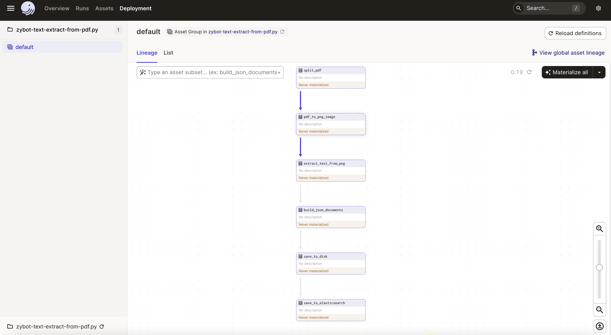
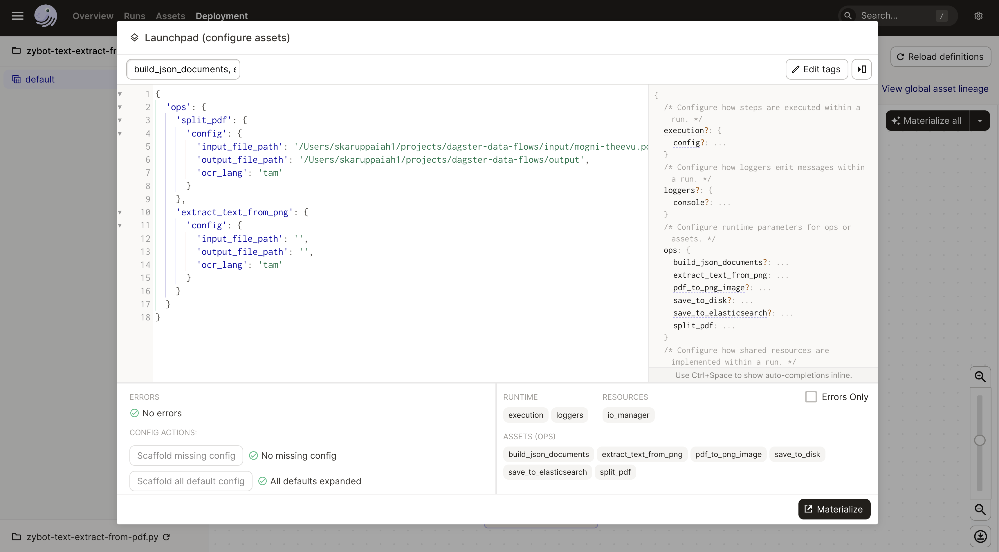
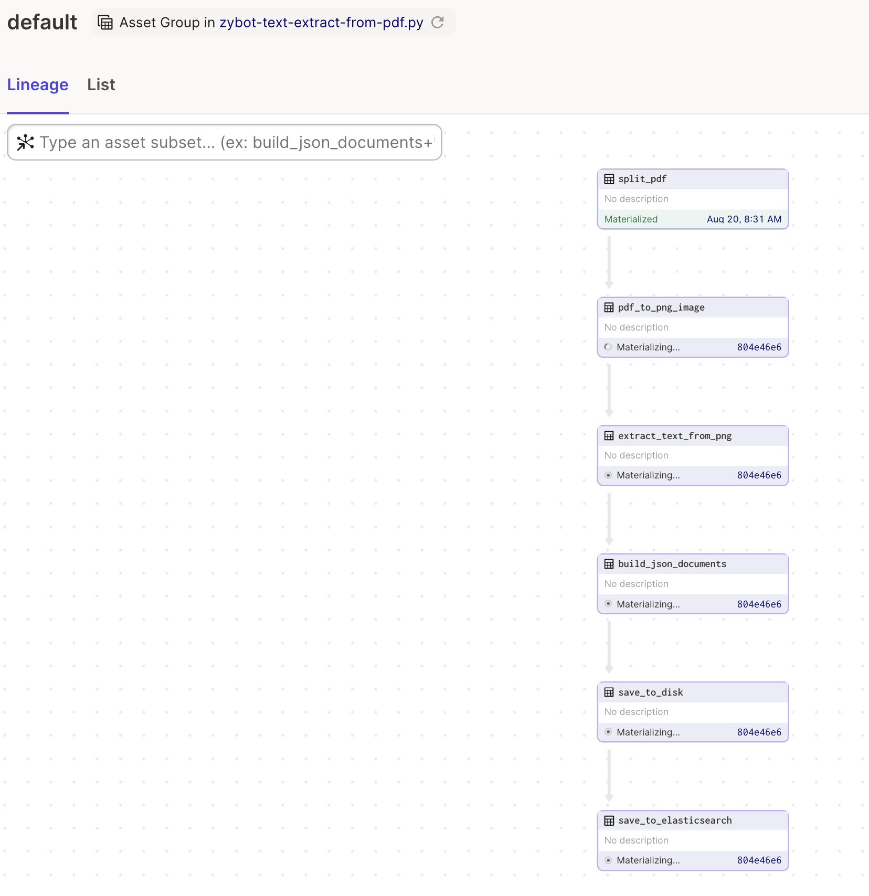
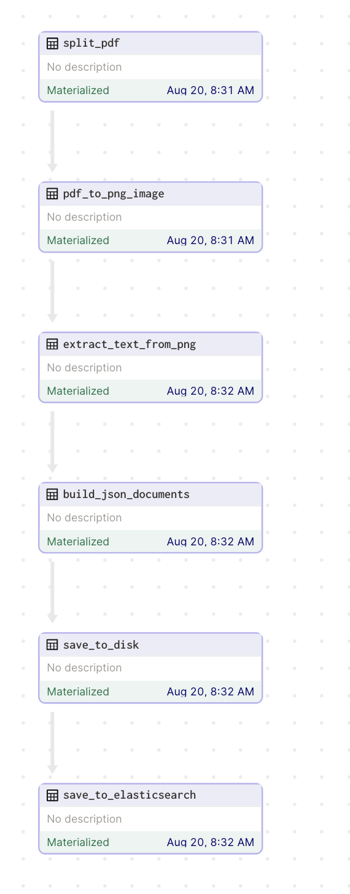
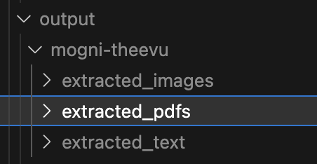
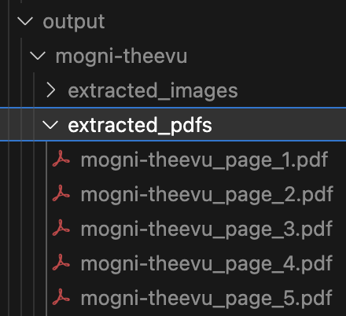
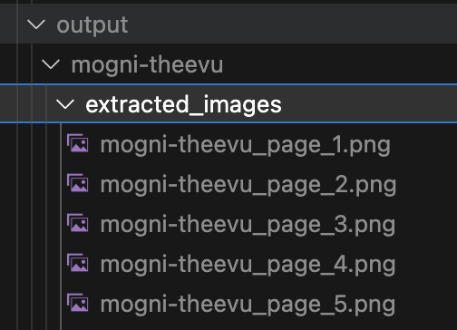
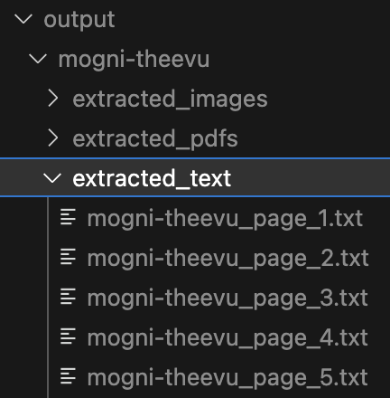

# dagster-data-pipeline

## Streamlining Data Workflows: How I Use Dagster to Solve Practical Problems for Reliable Data Pipelines


I'm sharing a collection of my work in data engineering that showcases practical applications of Dagster for managing and orchestrating data pipelines. Through these examples, you'll discover how Dagster helps streamline and optimize various data processes.

I approach each pipeline as a "bot" with a single responsibility, meticulously programmed with detailed inline comments, structured logging, and a standard style and convention ensuring each step is clear and maintainable.

**Why Dagster and not Airflow?**

I prefer `Dagster` for its `simplicity` and `embeddable` nature — no Docker or Kubernetes required for local development. It also ships with Data Catalog, Lineage, Federated Data Governance, and Data Quality features out of the box.

Visit the GitHub repository [dagster-data-pipeline](https://github.com/senthilsweb/dagster-data-pipeline).

---

## Mono-repo Structure

This repository is a **mono-repo**: each pipeline lives in its own sub-folder with an independent
Python package (`pyproject.toml`) and README. A root `workspace.yaml` wires all pipelines into a
single Dagster UI.

```
dagster-data-pipeline/
├── workspace.yaml                       ← single entry point for all pipelines
├── docker-compose.yaml                  ← run everything with docker compose up
├── sample.env                           ← copy to .env before docker compose up
├── dagster.yaml                         ← shared Dagster instance config
├── openspec/                            ← change management (proposals, designs, tasks)
│
├── minhash-lsh-fingerprint-pipeline/    ← MinHash + LSH document fingerprinting pipeline
│   ├── README.md
│   ├── Dockerfile
│   ├── pyproject.toml
│   ├── generate_docs.py                 ← synthetic corpus generator
│   ├── data/input/                      ← input documents
│   ├── data/output/                     ← pipeline artifacts
│   └── src/docfp/                       ← docfp Python package
│
├── es-indexer.py                        ← Elasticsearch indexing bot
├── text-extract-from-pdf.py             ← PDF OCR extraction bot
└── requirements.txt                     ← legacy script dependencies
```

### Pipelines

| Pipeline | Description | README |
|----------|-------------|--------|
| `minhash-lsh-fingerprint-pipeline` | Dagster-native document fingerprinting using MinHash + LSH for near-duplicate detection without embeddings | [README](minhash-lsh-fingerprint-pipeline/README.md) |
| `text-extract-from-pdf.py` | Split PDFs into pages, OCR each page, persist text to DuckDB / Elasticsearch | *(inline below)* |
| `es-indexer.py` | Index documents into Elasticsearch | *(inline below)* |

---

## Quick Start (all pipelines, local)

```bash
# 1. Create shared venv
python3.12 -m venv .venv && source .venv/bin/activate

# 2. Install fingerprint pipeline package
pip install -e "minhash-lsh-fingerprint-pipeline/[dev]"

# 3. Install legacy script dependencies
pip install -r requirements.txt

# 4. Launch Dagster UI (all pipelines in one view)
dagster dev -w workspace.yaml
# → http://127.0.0.1:3000
```

## Quick Start (Docker)

```bash
cp sample.env .env          # configure paths and thresholds

# Option A — pull pre-built image from GitHub Container Registry (fastest)
docker compose pull && docker compose up -d

# Option B — build locally from source
docker compose build && docker compose up -d

# → http://localhost:3000
docker compose down         # stop
```

> **Docker image:** `ghcr.io/senthilsweb/minlsh:latest` ([packages](https://github.com/senthilsweb/dagster-data-pipeline/pkgs/container/minlsh))
> Built for `linux/amd64` and `linux/arm64` via GitHub Actions on every tagged release.

---

## Automation Bots Roadmap

- [x] Split PDF documents and large books into PNGs, perform OCR to extract text, and save in DuckDB.
- [x] Document fingerprinting pipeline — MinHash + LSH near-duplicate detection without embeddings.
- [ ] Scrape Instagram posts and images, storing them in DuckDB.
- [ ] Import Jira issues into DuckDB for custom metrics and reporting.
- [ ] Create and seed databases for heterogeneous systems using a unified approach with DBT.
- [ ] Execute DBT jobs for the TickitDB ELT pipeline through Dagster.
- [ ] Send Slack notifications for various alerts and reminders.
- [ ] Perform scheduled data quality checks on demo data sources.

---

## Text Extraction from PDF for ebook digitisation

The first bot in my collection is designed to automate the process of extracting text from PDF documents. The bot, named text_extraction_pipeline.py, utilizes a Dagster pipeline to efficiently manage a sequence of data transformations. This sequence begins with splitting a single PDF document into individual pages, converting those pages into images, and then applying optical character recognition (OCR) to extract text from the images. Finally, the extracted text is persisted into a database, which can be either DuckDB or Elasticsearch depending on the setup.

## Python Environment Setup and activation

```bash
python3 -m venv env
```

```bash
source env/bin/activate
```

### Install dependencies

```bash
pip install -r requirements.txt
```

## Run the pipeline locally

```bash
dagster dev -f ./text-extract-from-pdf.py 
```

This will open up a dagit instance in your browser http://localhost:3000.



You can then run the pipeline by clicking on the `Materialize All` button. or  Materialize one by one by clicking on the `Launch Execution` button. 
Once you click on the `Launch Execution` button, you will be presented with the following screen to enter the input config params. Copy and paste the below. If the validation is successful, you will be able to see the `Execute` button.

> Adjust input_file_path to the location of your source PDF, and set output_file_path to the desired directory for storing output files. Note that output_file_path should specify a directory, not a file path. Output files will be named after the source file with the respective page number suffixed. For instance, if your source file is named Ilaiya-Raani.pdf, the output files will be sequentially named Ilaiya-Raani_1.pdf, Ilaiya-Raani_2.pdf, and so on, corresponding to each page of the PDF.

```python
{
  'ops': {
    'split_pdf': {
      'config': {
        'input_file_path': 'input/mogni-theevu.pdf',
        'output_file_path': 'output',
        'ocr_lang': 'tam'
      }
    },
    'extract_text_from_png': {
      'config': {
        'input_file_path': '',
        'output_file_path': '',
        'ocr_lang': 'tam'
      }
    }
  }
}
```



You will see the lineage and the execution process status in the dagit UI.



If all the jobs are successful, you will see the following screen.



Final result files will be available in the `output` directory.







