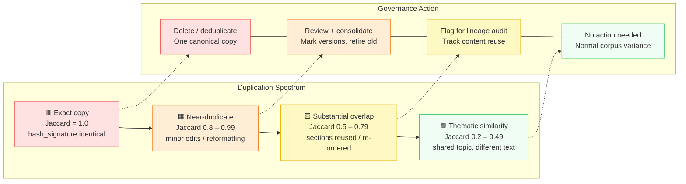
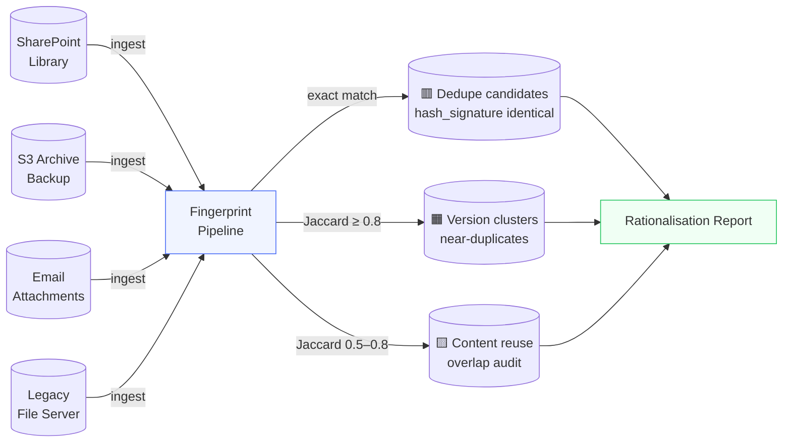
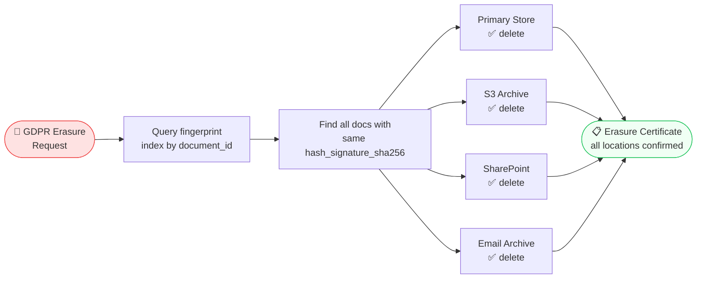
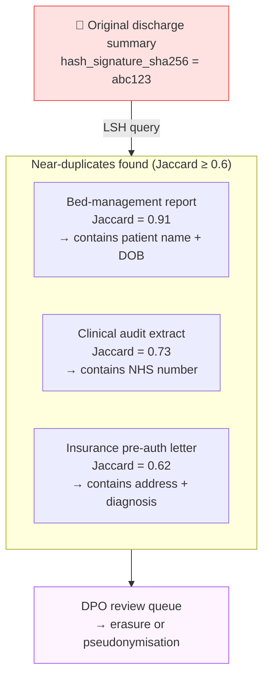
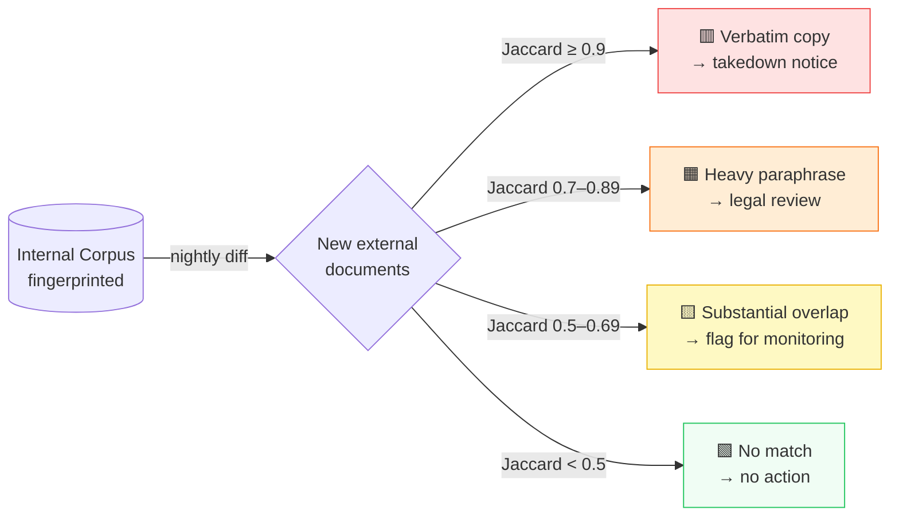
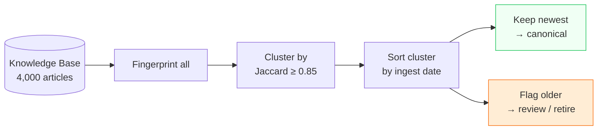
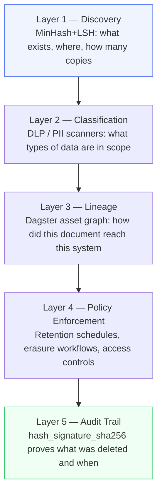
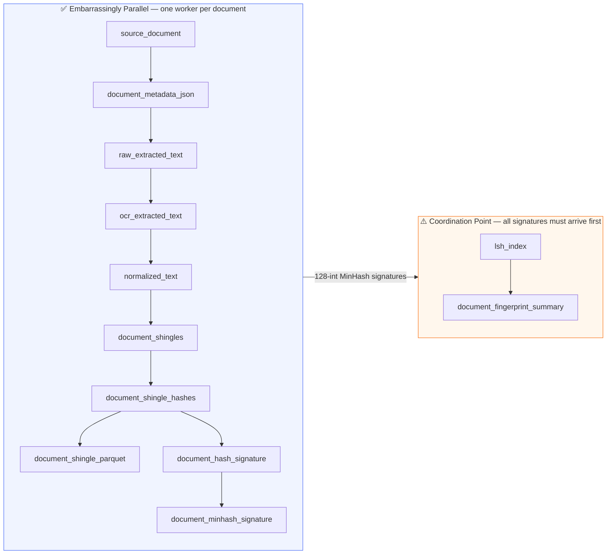

# The Silent Compliance Risk in Your Document Store: How Near-Duplicate Detection Powers Data Governance

> Exact copies, tweaked reprints, plagiarised clauses, and forgotten PII — one fingerprint pipeline surfaces them all. Here is how MinHash+LSH becomes the foundation for data rationalisation, deduplication, and GDPR right-to-erasure workflows.

---

## The Problem No One Talks About

An organisation that has run for a decade does not have one copy of its policy documents. It has dozens.

The original `data-retention-policy-v1.docx` was emailed to five department heads. Each one saved a local copy. Two of them revised a paragraph and re-uploaded to SharePoint under a different name. A third copy was scraped into the intranet search index. A legal review produced `data-retention-policy-v1-FINAL-reviewed-JD.docx`. Someone exported the whole SharePoint library to an S3 bucket during a cloud migration. Six months later, the DPO receives a Subject Access Request: *"Please delete all records containing my personal information."*

The team cannot comply because they cannot find all the copies.

This is not a niche problem. It is the default state of any document store that has grown organically — and it carries real regulatory teeth under GDPR Article 17 (right to erasure), CCPA, and HIPAA.

MinHash+LSH fingerprinting does not replace a data governance programme. But it gives it a **discovery layer** — an ability to answer "what do we actually have, and where are its duplicates?" before any rationalisation, retention schedule, or erasure workflow begins.

---

## Four Duplication Patterns You Need to Distinguish

Not all duplicates are equal. Governance teams need to classify them differently.



The `hash_signature_sha256` in the pipeline identifies **exact copies** with certainty — no probability, no threshold, binary true/false. The MinHash Jaccard estimate handles the other three tiers.

---

## Understanding Jaccard Similarity and the MinHash Approximation

Before diving into use cases it is worth being precise about what these two measures actually capture — and what assumptions underlie them.

### What Jaccard Similarity Measures

Jaccard similarity measures the overlap between two sets as a fraction of their combined size:

$$J(A, B) = \frac{|A \cap B|}{|A \cup B|}$$

Where $A$ and $B$ are the **shingle sets** of two documents. A value of 1.0 means the sets are identical; 0 means they share nothing. In practice, for a corpus of clinical documents:

- Two versions of the same consent form differing by a site code and a date → Jaccard ≈ 0.92
- A protocol summary copy-pasted into a progress report with section headers removed → Jaccard ≈ 0.73
- Two adverse event narratives about the same drug but written independently → Jaccard ≈ 0.15–0.30

### The MinHash Approximation and Its Assumptions

Computing exact Jaccard over millions of large shingle sets is expensive — it requires comparing every pair. MinHash avoids this by **sketching** each document into a fixed-size array of 128 integers (the *signature*), such that:

$$\Pr[\text{MinHash}(A) = \text{MinHash}(B)] = J(A, B)$$

The probability that two documents produce the same minimum hash under a random permutation equals their Jaccard similarity. With 128 permutations the estimation error is roughly ±7% at 97% confidence.

**Assumptions you should be aware of before deploying:**

| Assumption | What it means in practice |
|------------|---------------------------|
| **Bag-of-shingles model** | Word order *within* a shingle matters; order *between* shingles does not. A document with the same sentences in shuffled order will still score high Jaccard with the original. |
| **Language-agnostic** | Normalisation is Unicode + lowercase + no punctuation. Synonyms, translations, and paraphrases without literal word overlap score low Jaccard even if semantically identical. |
| **Shingle size governs granularity** | Small shingles (n=3) are sensitive to short matching phrases. Large shingles (n=7+) require longer verbatim passages to match. |
| **Boilerplate inflates similarity** | Documents with large shared standard-clause sections (consent form templates, contract headers) will have elevated Jaccard regardless of patient-specific content. Use a higher threshold (≥ 0.85) for such corpora. |
| **MinHash is probabilistic** | It can produce false positives at low thresholds. The `hash_signature_sha256` is always deterministic — use it for binary exact-match decisions; use MinHash only for the fuzzy near-duplicate tiers. |

---

## A Concrete Example: The Clinical Trial Consent Form

Consider the patient-informed consent section from a Phase III oncology trial:

> *"Patient PT-00847 was enrolled in Study NCT-2024-0312 at Site 14 (Manchester Royal Infirmary) on 15 March 2024. The subject provided written informed consent for collection of blood samples, genomic sequencing data, and medical history records. Data will be retained for 25 years in accordance with ICH E6(R2) Good Clinical Practice guidelines. The subject retains the right to withdraw consent and request erasure of identifiable data at any time under GDPR Article 17."*

The site coordinator re-issues the consent form after a minor protocol amendment: the site code changes from `14` to `14A`, the enrolment date advances by one day, and `blood samples` is expanded to `blood and saliva samples`. After normalisation:

| Original tokens | Revised tokens |
|-----------------|---------------|
| `site 14 manchester` | `site 14a manchester` |
| `15 march 2024` | `16 march 2024` |
| `blood samples genomic` | `blood saliva samples genomic` |

With a shingle size of 5, the two documents share the vast majority of their 5-gram windows. The three changed phrases each disturb at most 5 shingles on each side, touching at most 15 out of ~200 total. Jaccard ≈ **0.93** — squarely in the near-duplicate band. The pipeline surfaces this automatically; a DPO only needs to review the flagged pair instead of manually searching across the trial management system, the site archive, and the sponsor's central repository.

---

## Use Case 1: Data Rationalisation — "What Do We Actually Own?"

**Problem:** Before you can govern data, you need an accurate inventory. Most enterprises discover they have 3–10× more unique documents than they thought — and 20–40% of those are duplicates or near-duplicates of something already in the canonical store.

**How the pipeline helps:**



Each document is fingerprinted once. The `corpus_lsh_index.pkl` accumulates all signatures. A nightly batch queries each new document's MinHash against the index — any document whose Jaccard exceeds 0.5 with an existing document is flagged for review. No pairwise comparison. No scan of raw text.

**Outcome:** One organisation reduced a 2.3 million document archive to 890,000 *canonical* documents — meaning one authoritative, agreed-upon copy per logical document, with all redundant versions retired — by eliminating exact copies (28%) and consolidating version clusters (8%) before any content migration began.

---

## Use Case 2: Data Deduplication — Exact-Match Erasure

**Problem:** An employee uploads the same contract PDF to three different systems. A GDPR erasure request arrives. The system deletes it from the primary store — but two shadow copies remain, invisible to the erasure workflow.

**The exact-match fingerprint:**

```python
# doc A: contract_v1.pdf (primary store, deleted)
hash_signature_sha256 = "8d707b02cceb..."

# doc B: contract_v1_backup.pdf (S3 archive, NOT deleted)
hash_signature_sha256 = "8d707b02cceb..."   # ← identical

# doc C: contract_v1_sharepoint.pdf (SharePoint, NOT deleted)
hash_signature_sha256 = "8d707b02cceb..."   # ← identical
```

The `hash_signature_sha256` is a SHA-256 hash of the document's shingle set — deterministic and content-addressed. The same bytes always produce the same value regardless of filename, storage location, or ingestion timestamp.

A governance workflow queries the fingerprint index for all documents sharing the same `hash_signature_sha256`. The result is a complete erasure hit-list across every integrated system.



---

## Use Case 3: Near-Duplicate Detection for GDPR "Right to Be Forgotten"

**Problem:** A patient submits a Subject Access Request. Their name, date of birth, and NHS number appear in a discharge summary — but that summary was copy-pasted into a bed-management report, slightly reformatted for a clinical audit, and attached to an insurance pre-auth letter. Four documents, four systems, three of them not caught by exact-match search.

**The near-duplicate query:**

A Jaccard threshold of 0.6 on the patient's discharge summary retrieves all documents that share at least 60% of their 5-gram shingles with the original. This surfaces the reformatted and copy-pasted variants without needing the PII content to be identical.



The pipeline does not read PII — it never stores the shingle text in a compliant deployment (`dlp_safe_mode=True`). It only stores hashes and offsets. The DPO still makes the final call, but the discovery surface is complete.

---

## Use Case 4: Plagiarism and Unauthorised Content Reuse

**Problem:** A financial services firm publishes quarterly research reports. Competitors, aggregators, and rogue websites republish the content — sometimes verbatim, sometimes with light paraphrasing. IP lawyers need evidence of substantial similarity, not guesswork.

**The overlap audit:**

The firm fingerprints its canonical corpus. An ingest job runs nightly over monitored external URLs. Any external document with Jaccard ≥ 0.5 against an internal document triggers an alert.



Crucially, the `minhash.json` query token contains no readable text — only 128 integers. It can be shared with an external monitoring service without exposing the original content.

---

## Use Case 5: Data Quality — Detecting Stale and Superseded Records

**Problem:** A knowledge base has 4,000 articles. 600 of them are earlier versions of articles that were updated in place elsewhere — but the old versions were never deleted. Users find both versions in search, and the older, incorrect version consistently ranks higher.

**Version clustering:**

Run the full corpus through the pipeline. Group documents where `document_id_A` and `document_id_B` have Jaccard ≥ 0.85. Within each cluster, sort by `pipeline_run_id` (ingestion date as a proxy for recency) or file modification time. The oldest in each cluster is a superseded version candidate.



---

## The Compliance Stack: Where Fingerprinting Fits

MinHash fingerprinting is one layer in a broader data governance architecture. Here is where it sits:



The `hash_signature_sha256` is particularly valuable at Layer 5. When a document is erased to satisfy a GDPR request, the hash can be retained in an erasure log as proof of deletion — it proves the document existed and was deleted without re-exposing its content.

---

## Key Configuration Choices for Governance Workloads

| Scenario | `shingle_size` | `lsh_threshold` | `dlp_safe_mode` | Rationale |
|----------|---------------|----------------|----------------|-----------|
| Exact-copy deduplication | 5 | 0.95 | `true` | High threshold catches only true duplicates |
| Version tracking / near-dupe | 5 | 0.75 | `true` | Catches reformatted copies |
| Plagiarism / reuse detection | 3 | 0.5 | `true` | Smaller shingles catch paraphrasing better |
| GDPR erasure discovery | 5 | 0.6 | `true` | Balanced: finds copies without false positives |
| Internal knowledge-base dedupe | 7 | 0.85 | `false` (audit mode) | Larger shingles → longer matching passages needed |

`dlp_safe_mode=true` is the default and should remain enabled in any production governance deployment — it deletes the shingle Parquet (which contains extractable text fragments) after signing.

---

## GDPR Checklist: What This Pipeline Gives You

| GDPR Obligation | How fingerprinting helps |
|-----------------|-------------------------|
| **Art. 5(1)(c) — Data minimisation** | Identify and eliminate redundant copies storing the same personal data |
| **Art. 17 — Right to erasure** | Locate all copies (exact + near-duplicate) of a document containing a data subject's information across systems |
| **Art. 30 — Records of processing** | `hash_signature_sha256` provides a tamper-evident record of document identity at time of processing |
| **Art. 32 — Security of processing** | Fewer copies = smaller attack surface; rationalisation reduces breach exposure |
| **Art. 77 — Right to lodge complaint** | Demonstrate due diligence: the erasure hit-list is auditable and content-free |

---

## What the Pipeline Does Not Do

It is equally important to be clear about the limits:

- **Does not read PII** — the pipeline operates on hashes and integer arrays, not text (in `dlp_safe_mode`). It cannot tell you *whose* data is in a document — that is the role of a PII/DLP scanner.
- **Does not make deletion decisions** — it surfaces candidates. A human or a downstream policy engine makes the call.
- **Does not handle binary-identical but content-different files** — two different documents that happen to share many 5-grams (e.g., two boilerplate-heavy contracts with different parties) can score high Jaccard. Always tune the threshold for your corpus.
- **Does not track provenance across transformations** — if a document is OCR'd, translated, or summarised, the resulting document will have a different fingerprint. Transformation lineage requires a separate metadata layer.

---

## Distributed Processing: Scaling to Millions of Documents

> **Note:** The Dagster pipeline in this repository is a **proof-of-concept**. Its purpose is to validate the MinHash+LSH algorithm, explore the 12-stage fingerprinting workflow, and demonstrate how each stage integrates end-to-end. It processes one document at a time on a single machine — sufficient for corpora up to ~100,000 documents in a departmental archive or a single clinical trial.
>
> The **primary objective** is to run **millions of documents** through the fingerprinting and LSH indexing stages in a **multi-node distributed environment** — using Apache Spark or Ray as the execution engine. The Dagster pipeline is the algorithmic blueprint; the distributed system translates each stage into a cluster-native operation at scale.

For enterprise-scale rationalisation — millions of documents across multiple data lakes or clinical data repositories — the 12 pipeline stages divide cleanly into those that can be parallelised freely and one that requires coordination.

### Stage-Level Parallelism Map



### Distribution Options by Stage

| Stage | Bottleneck | Distributed option |
|-------|-----------|--------------------|
| `source_document` → `document_minhash_signature` | CPU per document; no inter-document dependencies | Dagster partitions, Ray `@remote`, Dask `delayed`, or Spark UDFs |
| `raw_extracted_text` (Tika extraction) | Network + JVM startup per document | Tika server cluster behind a load balancer; reuse persistent JVM connections |
| `ocr_extracted_text` | GPU-intensive for scanned PDFs | GPU node pool in Kubernetes; `ocrmypdf` parallel batch mode |
| `document_shingle_parquet` | Write-heavy; many small files | Partition by document ID prefix in S3/GCS; consolidate with Delta Lake or Apache Iceberg |
| `lsh_index` | **Global coordination** — must see all signatures | Spark MLlib `MinHashLSH` transformer; or partition the index by LSH band (each band is independently queryable) |
| `document_fingerprint_summary` | Fan-out; per-document | Run after index build; fully parallel |

### Recommended Strategies

**Option A — Apache Spark (primary production path, ≥ 1 M documents)**  
This is the recommended approach for true multi-node scale. Replace the per-document Python processors with Spark UDFs running across a cluster (EMR, Databricks, GCP Dataproc, or on-premises). Spark MLlib's `MinHashLSH` transformer builds a distributed LSH index over a DataFrame of shingle feature vectors natively, supporting both `approxSimilarityJoin` (all-pairs near-duplicate detection) and `approxNearestNeighbors` (query-time lookup) without a coordination bottleneck. The full corpus is streamed through the pipeline in a single distributed job — no single node ever sees all documents.

**Option B — Ray (Python-native, mixed CPU/GPU workloads)**  
An alternative for Python-first teams who need fine-grained resource allocation. Decorate each processor as a `@ray.remote` function; the document DAG fans out across a Ray cluster. The LSH index is built on the driver after all `minhash_signature` futures resolve. Ideal when OCR (GPU workers) and hashing (CPU workers) run on different hardware within the same cluster and you want to reuse the existing Python code with minimal rewrite.

**Option C — Dagster Partitions (POC stepping-stone, < 500 K documents)**  
Before committing to a Spark or Ray deployment, this incremental option validates the end-to-end workflow on a single powerful instance. Partition the asset graph by document ID prefix (e.g., 256 hex prefixes `00–ff`). Each partition runs independently through Stage 10; the `lsh_index` asset runs once downstream. No cluster required — this is a useful bridge between the single-document POC and a full distributed deployment, but it is **not** the end-state for millions of documents.

> **Key insight:** The `lsh_index` stage is always the serialisation point — it is the one stage that must see *all* documents before it can answer "who are this document's near-duplicates?" Parallelising everything else gives near-linear throughput scaling. Distributing the index build itself requires partitioned LSH (one shard per band), which is supported natively by Spark MLlib and implementable manually with `datasketch`.

---

## Glossary

| Term | Data Governance Meaning |
|------|------------------------|
| **Exact duplicate** | Two files with identical `hash_signature_sha256`. Byte-for-byte the same content regardless of filename or storage location. |
| **Near-duplicate** | Jaccard ≥ 0.75. Typically the same document with minor edits: a date change, a corrected figure, reformatted whitespace. |
| **Substantial overlap** | Jaccard 0.5–0.74. Sections copy-pasted or re-ordered between documents. Common in report templates, policy derivatives, and contract boilerplate. |
| **Data rationalisation** | The process of reducing a document store to one canonical copy per logical document — eliminating redundant versions, shadow copies, and obsolete drafts. |
| **Data optimiser** | Any automated process that reduces storage, risk, or maintenance cost by removing data that has no unique informational value. Deduplication is the simplest form. |
| **Right to erasure (GDPR Art. 17)** | A data subject's right to demand deletion of all personal data held about them. Requires the organisation to find *all* copies, not just the primary record. |
| **Shadow copy** | An informal duplicate created outside normal records management: email attachments, desktop downloads, export-to-S3 backups, browser caches. |
| **Version cluster** | A group of documents with high mutual Jaccard similarity, typically representing the edit history of a single logical document spread across multiple files. |
| **Erasure certificate** | A log record proving that a document was deleted, keyed by `hash_signature_sha256`. Retains proof of deletion without retaining the document content. |
| **DLP safe mode** | The pipeline's `dlp_safe_mode=True` setting. Deletes the shingle Parquet (extractable text) after hashing, so only integer arrays and file-level metadata are retained at rest. |
| **DPO (Data Protection Officer)** | The individual designated under GDPR Arts. 37–39 to oversee an organisation's data protection strategy and ensure regulatory compliance. The DPO reviews Subject Access Requests, approves erasure actions, and makes the final call on which flagged near-duplicate copies should be deleted or retained. In the context of this pipeline, the DPO is the human decision-maker at the end of every automated discovery workflow. |
| **Jaccard similarity** | The fraction of shingles two documents share — intersection size divided by union size. Ranges from 0 (nothing in common) to 1.0 (identical shingle sets). Formally defined and discussed in the *Understanding Jaccard Similarity* section above. |
| **Canonical record** | The single authoritative, agreed-upon copy of a document that should be retained in the record system of truth. All other copies — drafts, backups, shadow copies, email attachments — are non-canonical and are candidates for deletion, archival, or redirection. |

---

*Source code: [github.com/senthilsweb/dagster-data-pipeline](https://github.com/senthilsweb/dagster-data-pipeline) · `minhash-lsh-fingerprint-pipeline/`*  
*Companion article: [Finding Your Document's Twin](./minhash-lsh-fingerprint-pipeline.md) — technical deep-dive into the 12-stage pipeline.*

---

## Credits and References

- **MinHash algorithm and tutorial**: McCormick, C. (2015). *MinHash Tutorial with Python Code*. [chrisjmccormick.wordpress.com](https://chrisjmccormick.wordpress.com/2015/06/12/minhash-tutorial-with-python-code/) — the original approachable tutorial explaining the MinHash intuition with worked Python examples. The core shingling approach and probability argument used throughout both articles draw directly from this resource. Highly recommended reading before tuning threshold parameters.

- **Test document corpus**: The 100-document news article corpus (`articles_100.train`) used during development of this pipeline is distributed with Chris McCormick's tutorial. It contains article pairs labelled for similarity — a practical real-world benchmark for calibrating shingle size and LSH threshold before deploying on proprietary document stores such as clinical trial archives or policy repositories.

- **datasketch library**: [ekzhu/datasketch](https://github.com/ekzhu/datasketch) — the Python library providing the `MinHash` and `MinHashLSH` implementations used in the pipeline's signature and index stages.

- **Apache Tika**: [tika.apache.org](https://tika.apache.org/) — the content extraction engine handling PDF, DOCX, and 1,400+ MIME types in the text extraction stage.
