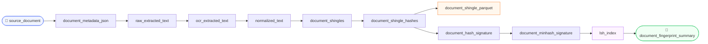

# Finding Your Document's Twin: Near-Duplicate Detection Without AI Embeddings

> How MinHash + LSH and a 12-stage Dagster pipeline fingerprint an entire document corpus in milliseconds — with no GPU, no vector database, and no embedding model.

---

## Background

Every content platform eventually faces the same quiet problem: the same article shows up twice. A healthcare insurer re-ingests a claim form with a corrected date. A news archive holds both the original wire report and an editor's lightly revised copy. A legal system accumulates contracts that differ by exactly one clause.

The classic solution is to compare documents pairwise — but that doesn't scale. A corpus of 1 million documents requires roughly 500 billion comparisons. Even at a microsecond per comparison, that's six days of compute for a single pass.

**MinHash + Locality-Sensitive Hashing (LSH)** solves this in sub-linear time. Instead of comparing raw documents, we compress each one into a small fixed-size _fingerprint_ — a 128-number sketch that captures its similarity structure. Two sketches can be compared in microseconds. The LSH index turns "find all near-duplicates" from an O(n²) scan into an O(1) lookup.

This article walks through an open-source implementation: a Dagster-native pipeline called **`minhash-lsh-fingerprint-pipeline`** that produces audit-grade fingerprints for any document type (PDF, DOCX, plain text) and ships as a multi-arch Docker image.

---

## How It Works — The Big Picture

The pipeline transforms a raw file into a **fingerprint summary** through 12 deterministic steps. No randomness, no model weights, no internet call — the same file always produces the same fingerprint.



Each box is an independently materializable **Dagster asset**. You can re-run any single stage without replaying the whole pipeline — crucial when you're tuning the shingle size or LSH threshold on a large corpus.

---

## A Concrete Example

Take this sentence from a news article:

> *"Azerbaijani government troops seized the town early Tuesday morning."*

After normalization it becomes:

```
azerbaijani government troops seized town early tuesday morning
```

With a shingle size of 5, the sliding window produces these overlapping 5-gram shingles:

| # | Shingle |
|---|---------|
| 1 | `azerbaijani government troops seized town` |
| 2 | `government troops seized town early` |
| 3 | `troops seized town early tuesday` |
| 4 | `seized town early tuesday morning` |

Now imagine a second article with a slightly different phrasing:

> *"Azerbaijani forces seized the town early on Tuesday."*

After normalization: `azerbaijani forces seized town early tuesday`

The shingle sets overlap significantly. Three of the four shingles from the first article have rough counterparts in the second. The Jaccard similarity of the two shingle sets will be, say, 0.65 — above the 0.5 threshold — and the LSH index will return them as near-duplicates without ever comparing the full documents.

---

## Stage-by-Stage Walkthrough

### Stage 1 — Metadata + Checksum

The file is hashed with SHA-256. This becomes the `document_id` — a stable, content-addressed identifier that changes only when the file bytes change.

```json
{
  "document_id": "acc78fbb2cdd...",
  "mime_type": "text/plain",
  "file_size_bytes": 1456,
  "pipeline_run_id": "2026-05-03T19:42:00Z"
}
```

### Stage 2 — Text Extraction

Apache Tika extracts raw text regardless of format — PDF, DOCX, or plain text. Tika handles 1,400+ MIME types. A plain-text fallback is used when the Tika server JAR is unavailable (e.g., no Java on the host).

### Stage 3 — OCR Decision

If `ocr_enabled=True` or if Tika returns fewer than `ocr_min_text_length` characters (default 50), the document is flagged for OCR. Scanned PDFs and image-heavy documents pass through `ocrmypdf` before continuing.

### Stage 4 — Normalization

The raw text is cleaned deterministically:
1. Unicode NFC normalisation (e.g., `café` → `cafe` in composed form)
2. Lowercase
3. Punctuation stripped
4. Whitespace collapsed

The output is a single clean string with a `normalization_version` field so future schema changes are detectable.

### Stage 5 — Tokenisation + Partitioning

The normalised text is split into word tokens. Long documents are partitioned into chunks (e.g., 512-token windows with overlap) so that shingles don't straddle unrelated passages.

### Stage 6 — Shingling

A sliding window of `shingle_size` words (default 5) moves across each partition, emitting one `ShingleRecord` per position. A 244-token document with shingle size 5 produces 240 shingles.

### Stage 7 — Hashing

Each shingle text is hashed twice:
- **SHA-256** — cryptographic, collision-resistant, used for exact-match provenance.
- **xxHash64** — extremely fast non-cryptographic hash; these values feed the MinHash algorithm.

### Stage 8 — Shingle Parquet (optional)

All shingle records (text, sha256, xxhash64, token offsets) are written to a Parquet file — 17 columns, one row per shingle. When `dlp_safe_mode=True` (the default), this file is deleted after signing to avoid retaining extractable text fragments.

### Stage 9 — Hash Signature

The set of SHA-256 hashes is merged across all partitions and hashed again to produce the `hash_signature_sha256` — a single hex string that is the document's **exact-match fingerprint**. Identical documents always produce the same value.

### Stage 10 — MinHash Signature

The xxHash64 values are fed into a `datasketch.MinHash` with 128 permutations. The result is a 128-integer array — a **probabilistic sketch** of the document's shingle set. Two sketches can estimate their Jaccard similarity in O(1).

Both signatures are written as JSON:

```json
// hash_signature.json — audit record
{
  "document_id": "acc78fbb...",
  "hash_signature_sha256": "8d707b02...",
  "minhash_signature": [412341, 99234, ...],
  "total_shingle_count": 240
}

// minhash.json — query token
{
  "hashvalues": [412341, 99234, ...],
  "num_perm": 128
}
```

### Stage 11 — LSH Index

The MinHash signature is inserted into a `MinHashLSH(threshold=0.5, num_perm=128)` index. The index is serialised as `corpus_lsh_index.pkl` — it grows as documents are processed. Querying it returns the `document_id` of every corpus document with Jaccard ≥ 0.5 to the query document.

### Stage 12 — Fingerprint Summary

A final JSON summary bundles all provenance: `document_id`, `hash_signature_sha256`, `minhash_num_perm`, shingle counts, output paths, and pipeline run timestamp.

---

## Querying the Index

```python
from docfp.processors.lsh_index_builder import LshIndexBuilder
import json, numpy as np
from datasketch import MinHash

lsh = LshIndexBuilder().load("data/output/indexes/corpus_lsh_index.pkl")

with open("data/output/signatures/some_doc.minhash.json") as f:
    m = json.load(f)

mh = MinHash(num_perm=m["num_perm"])
mh.hashvalues = np.array(m["hashvalues"], dtype=np.uint32)

# Returns document_ids of all near-duplicates with Jaccard >= 0.5
candidates = LshIndexBuilder().query(lsh, mh)
print(candidates)
```

---

## Output Artifacts

| File | Size (typical) | Purpose |
|------|---------------|---------|
| `metadata/{doc}.metadata.json` | ~0.6 KB | Content-addressed identity, MIME type |
| `text/{doc}.extracted.txt` | varies | Raw Tika output |
| `normalized/{doc}.normalized.txt` | varies | Cleaned text |
| `shingles/{doc}_shingle.parquet` | ~33 KB / 240 shingles | Full shingle table (DLP-deleted by default) |
| `signatures/{doc}.hash_signature.json` | ~2.3 KB | Exact-match fingerprint + MinHash values |
| `signatures/{doc}.minhash.json` | ~1.9 KB | Query token for LSH index |
| `indexes/corpus_lsh_index.pkl` | grows with corpus | Serialised LSH index |

---

## Running It

```bash
# Local (from dagster-data-pipeline/)
python3.12 -m venv .venv && source .venv/bin/activate
pip install -e "minhash-lsh-fingerprint-pipeline/[dev]"
dagster dev -w workspace.yaml
# → http://127.0.0.1:3000

# Docker
cp sample.env .env
docker compose pull && docker compose up -d
# → http://localhost:3000
```

Docker image: `ghcr.io/senthilsweb/minlsh:latest` (multi-arch: `linux/amd64`, `linux/arm64`)

---

## Glossary

| Term | Meaning |
|------|---------|
| **Shingle (n-gram)** | A contiguous sequence of _n_ words from a document. `"the quick brown fox jumped"` with n=3 → `["the quick brown", "quick brown fox", "brown fox jumped"]`. Captures local word order. |
| **Jaccard similarity** | Size of set intersection divided by size of set union. If doc A has shingles `{X, Y, Z}` and doc B has `{Y, Z, W}`, Jaccard = 2/4 = 0.5. |
| **MinHash** | A probabilistic algorithm that estimates Jaccard similarity from compact sketches. 128 permutations → ±7% estimation error with ~97% confidence. |
| **LSH (Locality-Sensitive Hashing)** | An index structure that groups similar MinHash sketches into the same "buckets" using hash banding. Querying a bucket finds near-duplicates without scanning the full corpus. |
| **Exact-match fingerprint** | `hash_signature_sha256` — a single hash of all shingle hashes. Identical for identical documents; completely different for any change. Use for deduplication. |
| **Approximate fingerprint** | The 128-value MinHash array. Similar (but not identical) documents produce similar arrays. Use for near-duplicate detection. |
| **DLP safe mode** | Data Loss Prevention: deletes the shingle Parquet after signing so no extractable text fragments are stored at rest. Enabled by default. |
| **Dagster asset** | A declarative unit of data — a function that produces a persistent artifact. Dagster tracks lineage, allows partial re-materialisation, and provides a visual DAG. |
| **Tika** | Apache Tika — a content detection and extraction library supporting 1,400+ file formats. Used here to extract raw text from PDF, DOCX, and other formats. |
| **xxHash64** | A non-cryptographic hash function optimised for speed (~13 GB/s). Used to convert shingle text into integers for MinHash. |

---

## Why Not Embeddings?

Vector embeddings (from BERT, OpenAI, etc.) capture _semantic_ similarity — "cat" and "feline" score as similar. MinHash captures _lexical_ similarity — overlapping words and phrases. For duplicate detection (plagiarism, re-ingestion, version tracking) lexical similarity is exactly what you want, and MinHash delivers it without:

- A GPU
- An API key or network call
- A vector database
- Non-determinism between model versions

The same file, processed on any machine, on any date, always produces the same `hash_signature_sha256`. That's the property you need for audit trails and compliance.

---

*Source code: [github.com/senthilsweb/dagster-data-pipeline](https://github.com/senthilsweb/dagster-data-pipeline) · `minhash-lsh-fingerprint-pipeline/`*
